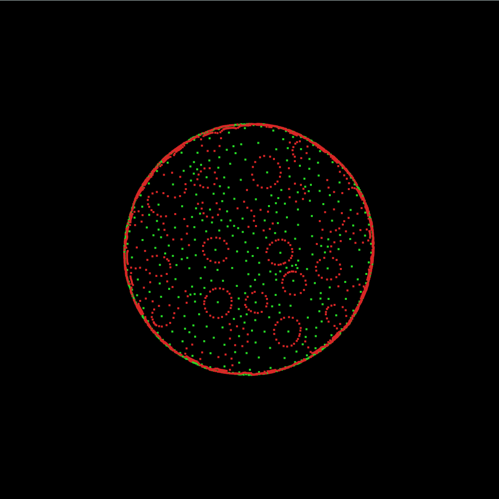
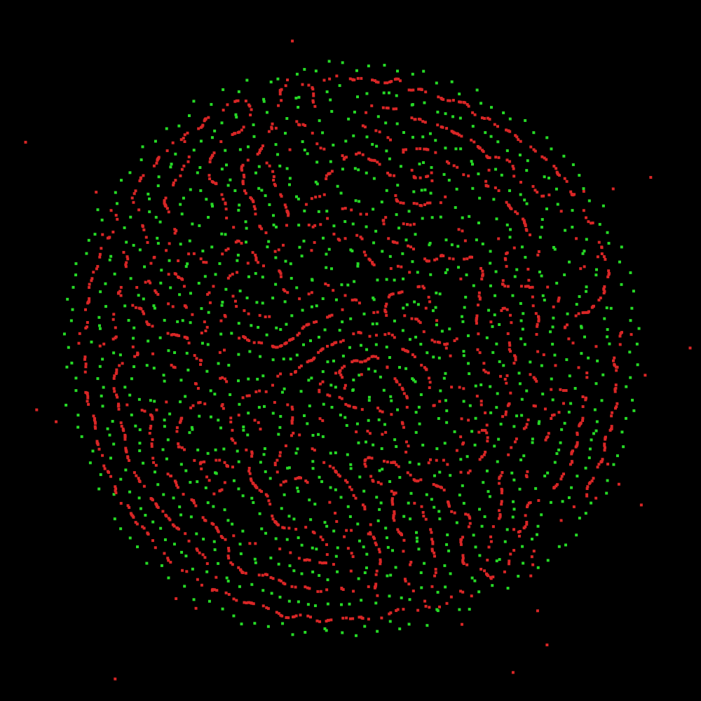
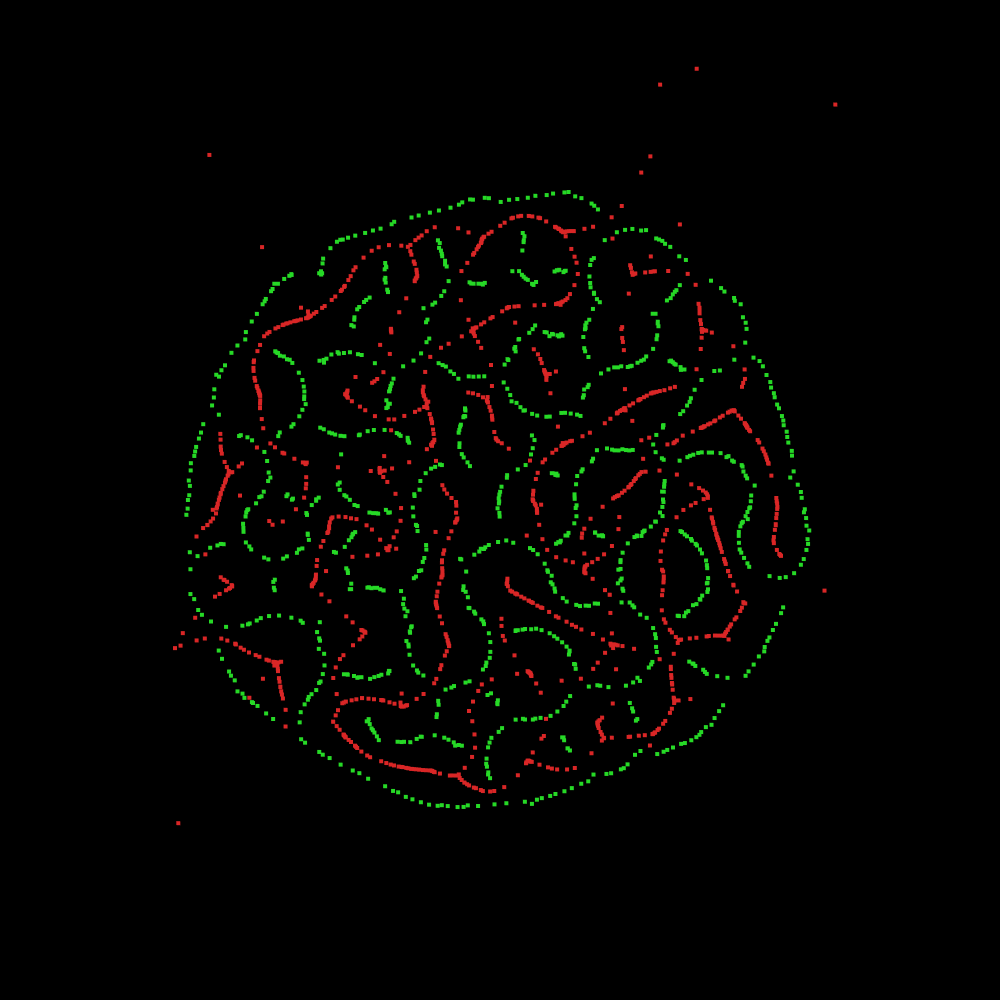
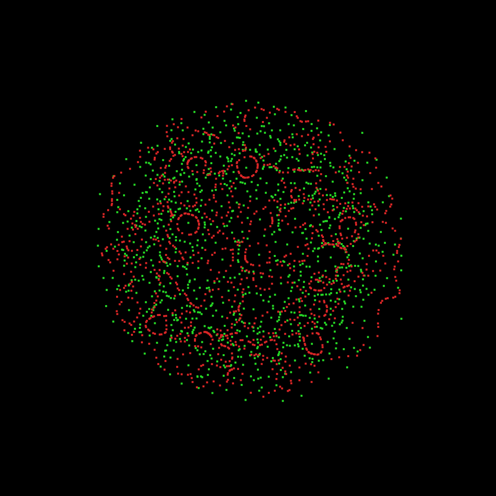

# DynamicFoam

Dynamic Foam Simulation / Zero-Player-Game

## What is this?

This is an implementation of a concept presented to me by **Michel van de Gaer**.

The concept describes a "zero-player-game" played on a "foam", i.e. some form of
triangle center mesh on a triangulation of the plane.

### Dynamics

Based on the angles between the edges, we can assume a least-energy-path for particles moving through the medium. The structure of the foam then allows the paths to converge to periodic orbits, which can also be shaped like knots. The cumulative flow along the edges of the cells can then be used to let the adjacent cells contract and expand.

### Initial Condition

The system is initialized using the delaunay triangulation of a set of blue-noise points (sampled using a naive poisson disc). The dynamics can then run on varying triangle center foams, e.g. circumcenter, barycenter or incenter.

### Results

Particularly for the circumcenter foam, the resulting patterns strongly resemble reaction-diffusion patterns, but with added dynamics and non-static.

Adding cell expansion at higher flow volumes can also result in oscillatory patterns emerging. For the barycenter foam with expansive flow, one can get very nice stable periodic orbits forming in the flow paths.

Expanding Cells at Higher Flow-Rates

Barycentric Orbits

## Running

This system was built using [TinyEngine](https://github.com/weigert/TinyEngine). Install TinyEngine and then use the makefile to create an executable:

    make all

Note the dependencies in TinyEngine and the compatibility requirements.

## Known Issues

Occasionally, depending on the seeding (i.e. initial condition) the system can diverge. This is because it is dynamic. In that case, kill the progarm and try again with a new seed. I am not quite sure what dynamic aspect causes the instability.
